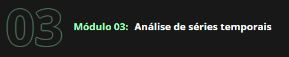

Neste módulo vamos descobrir o que são séries temporais e estudar suas particularidades.

Todo arcabouço teórico adquirido até aqui será aplicado para o entendimento das nuances envolvendo as séries temporais. Da estatística descritiva, passando pela análise exploratória e chegando às previsões, sempre de forma aplicada e prática utilizando ferramentas específicas para esse tipo de dados, como o StatisModel e Prophet desenvolvido pelo Facebook.

# O que é abordado no Modulo 3:
* Aprendemos o que é uma série temporal;
* Calculamos a taxa de crescimento de um evento em uma série temporal;
* Aprendemos o que é uma média móvel;
* Entendemos o que é correlação e função de autocorrelação;
* Vimos as primeiras previsões com o PROPHET;
* Fizemos a decomposição de séries temporais;
* Curva com o crescimento logístico;
* Mudança de tendência em uma série temporal;
* Como decidir se houve mudança de tendência através de um gráfico de barras;
* Efeito da sazonalidade e feriados em uma série temporal;
* Sazonalidade aditiva e sazonalidade multiplicativa;
* Previsões considerando sazonalidade e feriados com o PROPHET;
* Tratamento de outliers;
* Intervalo de confiança;
* Validação cruzada de encadeamento direto;
* Métricas de performance.