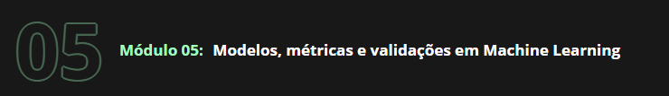

No último módulo aplicamos todo nosso conhecimento para analisar dados da COVID-19, entender alguns dos desafios dos hospitais em época de pandemia e propor soluções a partir das análises de dados.

Nossa proposta de solução foi utilizar modelos de Machine Learning, mas para tornar isso possível precisamos aprofundar nossos conhecimentos nesta área, testando modelos mais avançados, utilizando métricas adequadas ao problema e validando de forma correta. Neste módulo vamos trabalhar todas estas frentes para tornar nossa solução uma proposta viável.

# O que é abordado no Modulo 5:
* Qual é um possível Workflow em um projeto de Data Science;
* Realizar uma transformação de dados em dados categóricos;
* Aumentar o número de iterações da regressão logística para convergir;